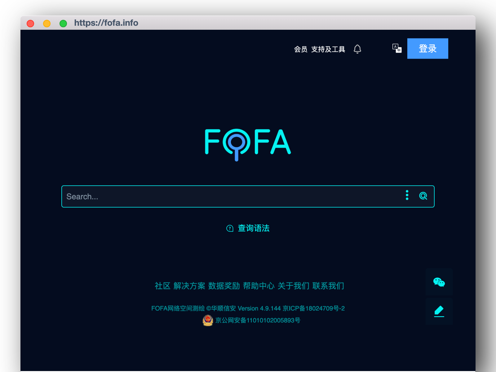

# Chrome Proxy

调用 chromedp 进行网页渲染，对渲染内容进行截图/保留



## 通过 Golang 调用
```golang
package main

import (
	"fmt"
	"github.com/LubyRuffy/chrome_proxy/models"
	"github.com/LubyRuffy/chrome_proxy/screenshot"
	"github.com/LubyRuffy/chrome_proxy/utils"
	"os"
)

func main() {
	url := "https://fofa.info"

	// take screenshot
	screenshotOutput, err := screenshot.ScreenshotURL(&models.ChromeParam{
		Sleep:   5,
		Timeout: 30,
		ChromeActionInput: models.ChromeActionInput{
			URL: url,
		},
	})
	if err != nil {
		fmt.Printf("fail to take screenshot for %s, %s", url, err.Error())
		return
	}

	fmt.Printf("screenshot for url: %s, title: %s", screenshotOutput.Location, screenshotOutput.Title)

	// save screenshot result to png file
	fn, err := utils.WriteTempFile(".png", func(f *os.File) error {
		_, err = f.Write(screenshotOutput.Data)
		return err
	})
	if err != nil {
		fmt.Printf("fail to save png file: %s", err.Error())
		return
	}

	fmt.Printf("save picture to: %s", fn)
}
```

---
# 通过 Docker 启动

用chrome的docker环境做最简单的截图服务器。

## 编译

```shell
docker build --tag lubyruffy/chrome_proxy:latest .
```

## 测试运行

运行
```shell
docker run --rm -it -p5558:5558 lubyruffy/chrome_proxy:latest
```

保存镜像
```shell
docker save -o chrome_proxy.tar lubyruffy/chrome_proxy:latest
```

截图
```shell
curl -d '{"url":"http://www.baidu.com", "sleep":1, "timeout":10}' http://127.0.0.1:5558/screenshot
```
```json
{
  "code": 200,
  "url": "http://www.baidu.com",
  "data": "iVB...base64..."
}
```

附带url的截图
```shell
curl -d '{"url":"http://www.baidu.com", "sleep":1, "timeout":10, "add_url": true}' http://127.0.0.1:5558/screenshot
```
```json
{
    "code": 200,
    "url": "http://www.baidu.com",
    "data": "/9j/4...base64..."
}
```
截图预览：


渲染dom
```shell
curl -d '{"url":"http://www.baidu.com", "sleep":1, "timeout":10}' http://127.0.0.1:5558/renderDom
```
```json
{
  "code": 200,
  "url": "https://www.baidu.com",
  "data": "<html>...</html>",
  "title": "百度一下，你就知道",
  "location": "https://www.baidu.com/"
}
```

使用自定义代理 & UA
```shell
curl -d '{"url":"http://www.baidu.com", "sleep":1, "timeout":10, "proxy":"socks5://127.0.0.1:7890", "user_agent":"Mozilla/5.0 (Windows NT 10.0; Win64; x64) AppleWebKit/537.36 (KHTML, like Gecko) Chrome/102.0.5005.124 Safari/537.36 Edg/102.0.1245.44"}' http://127.0.0.1:5558/screenshot
```
```json
{
  "code": 200,
  "message": "",
  "url": "http://www.baidu.com",
  "data": "iVBOR..."
}
```

